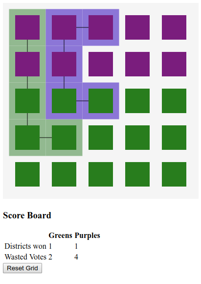

## Gerrymandering tool.

This tool is used to help demonstrate the various ways Gerrymandering can be used to disproportionately represent the wants of voters. 

To use the tool `npm i -S gerrymandering-demo`

And in your HTML file, pull in the javascript file:

`<script src="node_modules/GerrymanderingDemo/dist/main.js">

And on your page where you want the code to show up, add an element with an id of `gerrymandering-demo`

`

`

### Optional

If you also want to pull in the `css` for the file, be sure to pull in the `css` file that is part of this package.

`<link rel="stylesheet" href="/node_modules/GerrymanderingDemo/styles.css">`